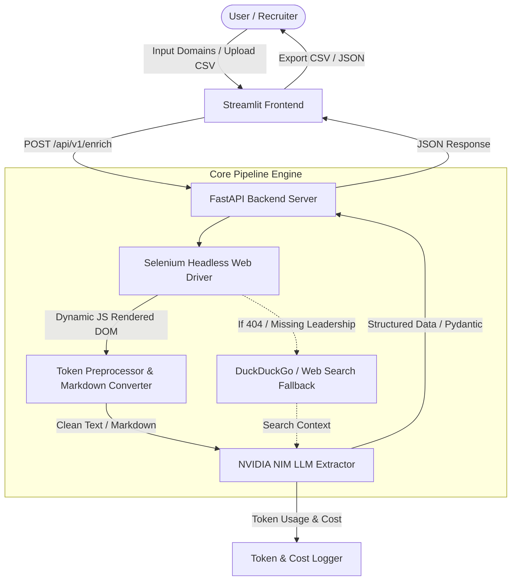

# Architecture & Design Specification: Autonomous Lead Enrichment Agent

## 1. System Overview
The **Autonomous Lead Enrichment Agent** is an end-to-end AI-powered web scraper and intelligence extraction pipeline. It accepts target company domains, autonomously crawls and parses their public web presence using **Selenium Headless Web Driver**, pre-processes DOM structures to optimize LLM token usage, extracts structured lead data via the **NVIDIA NIM API** (or fallback mock mode), and returns high-confidence actionable insights.

Key architectural features:
- **FastAPI Backend**: Asynchronous API server orchestrating scraping, DOM processing, LLM extraction, and search fallback mechanisms.
- **Streamlit Frontend**: Minimal, responsive dashboard for uploading domain lists, viewing structured data, and exporting JSON/CSV.
- **Selenium Headless Browser Driver**: Executes JavaScript, renders single-page application (SPA) elements, navigates subpages (`/about`, `/team`, `/company`, `/contact`, `/pricing`), and extracts dynamic text cleanly without depending on static HTML parsers like BeautifulSoup.
- **NVIDIA NIM LLM Engine**: OpenAI-compatible Python client (`openai` library pointing to `https://integrate.api.nvidia.com/v1`) using `meta/llama-3.3-70b-instruct` (or `nvidia/neva-22b`) for structured output extraction.
- **Search Fallback Engine**: Automatic web search lookup (via DuckDuckGo / Tavily fallback) for missing contact details or LinkedIn URLs.
- **Token & Cost Tracker**: Logs prompt/completion tokens and estimates API cost per scraped domain.

---

## 2. High-Level Architecture Diagram



---

## 3. Tech Stack Specification

| Component | Technology | Purpose |
| :--- | :--- | :--- |
| **Backend Framework** | FastAPI (Python 3.10+) | Asynchronous REST API engine |
| **Frontend Framework** | Streamlit | Lightweight dashboard for interactive domain extraction |
| **Browser Automation** | Selenium (`selenium` + `webdriver-manager`) | Headless Chrome browser automation for dynamic JS execution & SPA scraping |
| **DOM Preprocessing** | Native Selenium DOM queries + `html2text` | JS script stripping, boilerplate filtering, dynamic DOM text extraction |
| **LLM Provider** | NVIDIA NIM API | Structured extraction via `https://integrate.api.nvidia.com/v1` (`NVIDIA_API_KEY`) |
| **Model** | `meta/llama-3.3-70b-instruct` | High-reasoning model for schema JSON extraction |
| **Schema Validation** | Pydantic v2 | Strict JSON schema validation for LLM outputs |
| **Search Fallback** | `duckduckgo-search` / `httpx` | External search lookup for missing team member LinkedIn URLs |
| **Environment Mgmt** | `python-dotenv` | API keys and configuration management |

---

## 4. Pipeline Execution Flow

### Step 1: Automated Browsing & Dynamic JS Rendering (Selenium)
1. Backend accepts input domain (e.g. `postman.com`).
2. Normalizes URL (`https://postman.com`).
3. Launches Selenium Headless Chrome Driver with stealth options (`--headless=new`, `--disable-gpu`, `--no-sandbox`, `--disable-dev-shm-usage`).
4. Loads homepage, waits for JS execution, and extracts subpage links matching keywords: `/about`, `/company`, `/team`, `/leadership`, `/contact`, `/pricing`.
5. Navigates to discovered subpages in headless browser session.

### Step 2: DOM Cleanup & Token Optimization
1. Executes Javascript DOM cleaning inside Selenium driver to strip non-essential nodes: `<script>`, `<style>`, `<svg>`, `<nav>`, `<footer>`, `<header>`, `<iframe>`.
2. Extracts clean inner text and converts to structured Markdown.
3. Truncates text payload to safe token limits (~4,000-6,000 words per domain).

### Step 3: LLM Extraction (NVIDIA NIM API)
1. Constructs prompt with strict Pydantic JSON schema constraints.
2. Calls NVIDIA NIM API (`https://integrate.api.nvidia.com/v1/chat/completions`) using `NVIDIA_API_KEY`.
3. If no key is provided, seamlessly degrades to smart dry-run mock extraction to keep application testable.
4. Extracts structured data:
   - `company_overview` (2-sentence summary)
   - `target_audience_icp` (Target customer profile)
   - `contact_points` (Public email addresses)
   - `key_leadership` (Names, roles, and LinkedIn URLs)
   - `data_confidence_score` (0.0 to 1.0)
5. Computes token usage and estimated cost ($USD).

### Step 4: Search Fallback & Resilience Strategy
- **Selenium Timeout/Block**: Standard `httpx` request fallback.
- **Missing LinkedIn Profiles**: Triggers DuckDuckGo search query `"<Person Name> <Company Name> LinkedIn"` to find external LinkedIn profile URLs.
- **Malformed JSON**: Schema retries and automatic JSON formatting corrections.

---

## 5. Directory Structure

```
lead-enrichment-agent/
├── backend/
│   ├── app/
│   │   ├── __init__.py
│   │   ├── main.py                  # FastAPI Application Entrypoint
│   │   ├── config.py                # Environment & NVIDIA NIM configuration
│   │   ├── schemas/
│   │   │   └── enrichment.py        # Pydantic schemas
│   │   ├── services/
│   │   │   ├── scraper.py           # Selenium Headless Browser Crawler
│   │   │   ├── preprocessor.py      # DOM cleaning & Markdown converter
│   │   │   ├── llm_extractor.py     # NVIDIA NIM API client & Token logger
│   │   │   └── search_fallback.py   # DuckDuckGo search fallback
│   │   └── api/
│   │       └── router.py            # API endpoints (/enrich, /health)
├── frontend/
│   └── app.py                       # Streamlit UI application
├── output.json                      # Sample extracted output for 3 test domains
├── output.csv                       # Sample extracted CSV format
├── .env.example                     # Environment template (NVIDIA_API_KEY)
├── .env                             # Local environment file
├── requirements.txt                 # Dependencies (selenium, webdriver-manager, fastapi, etc.)
├── gemini.md                        # Architecture & design document
└── README.md                        # Submission document & guide
```

---

## 6. Required Answers & Submission Requirements
- **Operations Question Answer**: Explicit confirmation of comfort with 40% manual prospecting ops.
- **Test Domains**: Executed on `postman.com`, `supabase.com`, `vapi.ai`.
- **Outputs**: Generated `output.json` and `output.csv`.
